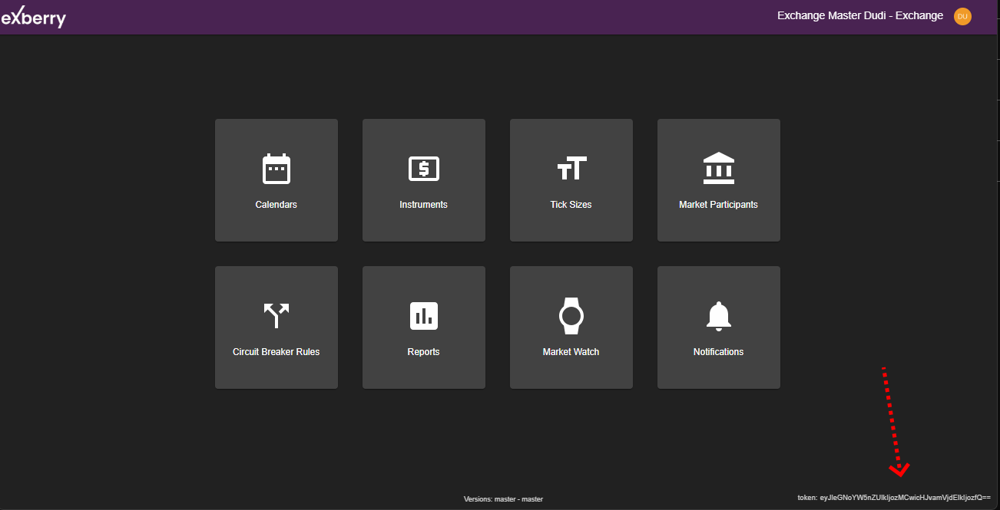

# Introduction

Exberry Market Data API offers access to aggregated, close to real time market data.

> endpoint : wss://api-gateway.uat.exberry-uat.io

The Market Data API supports two access modes:

**Public Access**\
The API is available without prior operator configuration. Access is granted using a token for environment routing purposes only. No authentication is required.

**Authenticated Access**\
Access is restricted to authorized parties only. Authentication is required via either an API key or a Trader login, as configured by the operator.

You can retrieve your token from Admin Application home page:

<figure><figcaption></figcaption></figure>

