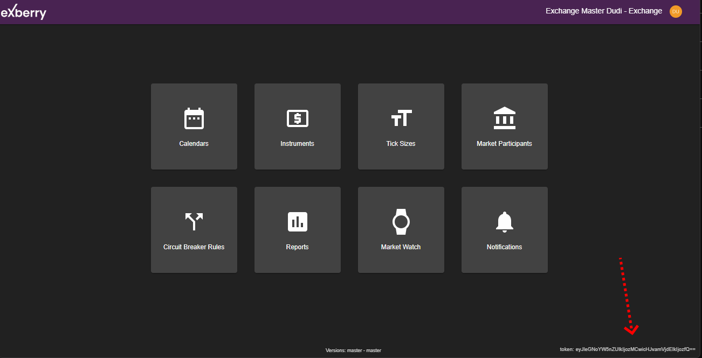

# Introduction

Exberry Market Data API offers access to aggregated, close to real time access for market data.


endpoint : wss://api-gateway-staging.site.staging.exberry-uat.io


In order to access Market Data API you need to have token for each and every environment, you can retrieve your token from Admin Application home page:

<figure><figcaption></figcaption></figure>
